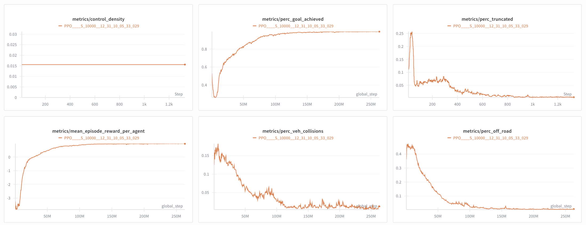

# Official Repository for Scenario Dreamer

<p align="left">
<a href="https://arxiv.org/abs/2503.22496" alt="arXiv">
    </a>
<a href="https://princeton-computational-imaging.github.io/scenario-dreamer/" alt="webpage">
    </a>
<a href="https://youtu.be/kShULuL8VO4" alt="youtube">
    </a>
<a href="https://drive.google.com/drive/folders/13DSHf2UhrvguD7i7iYL5SfSDhgLcW_ja?usp=sharing" alt="google drive">
    </a>

> [**Scenario Dreamer: Vectorized Latent Diffusion for Generating Driving Simulation Environments**](https://arxiv.org/abs/2503.22496)  <br>
> [Luke Rowe](https://rluke22.github.io)<sup>1,2,6</sup>, [Roger Girgis](https://mila.quebec/en/person/roger-girgis/)<sup>1,3,6</sup>, [Anthony Gosselin](https://www.linkedin.com/in/anthony-gosselin-098b7a1a1/)<sup>1,3</sup>, [Liam Paull](https://liampaull.ca/)<sup>1,2,5</sup>, [Christopher Pal](https://sites.google.com/view/christopher-pal)<sup>1,2,3,5</sup>, [Felix Heide](https://www.cs.princeton.edu/~fheide/)<sup>4,6</sup>  <br>
> <sup>1</sup> Mila, <sup>2</sup> Université de Montréal, <sup>3</sup> Polytechnique Montréal, <sup>4</sup> Princeton University, <sup>5</sup> CIFAR AI Chair, <sup>6</sup> Torc Robotics <br>
> <br>
> Computer Vision and Pattern Recognition (CVPR), 2025 <br>
>

We propose Scenario Dreamer, a fully data-driven closed-loop generative simulator for autonomous vehicle planning.

<video src="https://github.com/user-attachments/assets/83bcea5f-a459-45b7-8d36-eb9dd76e100a" width="250" height="250"></video>

## Repository Timeline

- [x] [06/11/2025] Environment setup
- [x] [06/11/2025] Dataset Preprocessing
- [x] [07/21/2025] Train Scenario Dreamer autoencoder model on Waymo and NuPlan
- [x] [07/21/2025] Train Scenario Dreamer latent diffusion model on Waymo and NuPlan
- [x] [07/21/2025] Support generation of Scenario Dreamer initial scenes
- [x] [07/21/2025] Support visualization of Scenario Dreamer initial scenes
- [x] [07/21/2025] Support computing evaluation metrics
- [x] [07/21/2025] Release of pre-trained Scenario Dreamer checkpoints
- [x] [07/21/2025] Support lane-conditioned object generation
- [x] [10/25/2025] Support inpainting generation mode
- [x] [10/31/2025] Support generation of large simulation environments
- [x] [11/05/2025] CtRL-Sim Dataset Preprocessing
- [x] [11/05/2025] Train CtRL-Sim behaviour model on Waymo
- [x] [11/25/2025] Release of 1M-step pre-trained CtRL-Sim checkpoint
- [x] [11/25/2025] Evaluate IDM policy in Scenario Dreamer environments
- [x] [01/12/2026] Train Scenario-Dreamer compatible agents in GPUDrive
- [x] [01/12/2026] Evaluate GPUDrive-trained RL policy in Waymo and Scenario Dreamer environments

## Table of Contents
1. [Setup](#setup)
2. [Waymo Dataset Preparation](#waymo-dataset-preparation)
3. [Nuplan Dataset Preparation](#nuplan-dataset-preparation)
4. [Pre-Trained Checkpoints](#pretrained-checkpoints)
5. [Training](#training)
6. [Evaluation](#evaluation)
7. [Simulation](#simulation)
8. [GPUDrive Integration](#gpudrive-integration)
9. [Citation](#citation)
10. [Acknowledgements](#acknowledgements)

## Setup <a name="setup"></a>

Start by cloning the repository
```
git clone https://github.com/princeton-computational-imaging/scenario-dreamer.git
cd scenario-dreamer
```

This repository assumes you have a "scratch" directory for larger files (datasets, checkpoints, etc.). If disk space is not an issue, you can keep everything in the repository directory:
```
export SCRATCH_ROOT=$(pwd) # prefer a separate drive? Point SCRATCH_ROOT there instead.
```

Define environment variables to let the code know where things live:
```
source $(pwd)/scripts/define_env_variables.sh
```

### Conda Setup 

```
# create conda environment
conda env create -f environment.yml
conda activate scenario-dreamer

# login to wandb for experiment logging
export WANDB_API_KEY=<your_api_key>
wandb login
```

## Waymo Dataset Preparation <a name="waymo-dataset-preparation"></a>

> **Quick Option:**  
> If you'd prefer to skip data extraction and preprocessing, you can directly download the prepared files.
> Place the following tar files in your scratch directory and extract:
> - `scenario_dreamer_ae_preprocess_waymo.tar` (preprocessed dataset for Scenario Dreamer autoencoder training on Waymo)  
> - `scenario_dreamer_ctrl_sim_preprocess.tar.gz` (preprocessed dataset for CtRL-Sim training on Waymo)
> [Download from Google Drive](https://drive.google.com/drive/folders/13DSHf2UhrvguD7i7iYL5SfSDhgLcW_ja?usp=sharing)  

<details> <summary><strong>Instructions</strong></summary>

Download the Waymo Open Motion Dataset (v1.1.0) into your scratch directory with the following directory structure:

```
$SCRATCH_ROOT/waymo_open_dataset_motion_v_1_1_0/
├── training/
│   ├── training.tfrecord-00000-of-01000
│   ├── …
│   └── training.tfrecord-00999-of-01000
├── validation/
│   ├── validation.tfrecord-00000-of-00150
│   ├── …
│   └── validation.tfrecord-00149-of-00150
└── testing/
    ├── testing.tfrecord-00000-of-00150
    ├── …
    └── testing.tfrecord-00149-of-00150
```

Then, we preprocess the waymo dataset to prepare for Scenario Dreamer model training. The first script takes ~12hrs and the second script takes ~12hrs (8 CPU cores, 64GB RAM):
```
bash scripts/extract_waymo_data.sh # extract relevant data from tfrecords and create train/val/test splits
bash scripts/preprocess_waymo_dataset.sh # preprocess data to facilitate efficient model training
bash scripts/preprocess_ctrl_sim_waymo_dataset.sh # preprocess data to facilitate efficient ctrl_sim model training
```

</details>

## NuPlan Dataset Preparation <a name="nuplan-dataset-preparation"></a>

> **Quick Option:**  
> If you'd prefer to skip data extraction and preprocessing, you can directly download the prepared files:
> Place the following files in your scratch directory and extract:
> - `scenario_dreamer_nuplan.tar` (processed nuPlan data (required for computing metrics, but not required for training)) 
> - `scenario_dreamer_ae_preprocess_nuplan.tar` (preprocessed dataset for Scenario Dreamer autoencoder training on nuplan)  
> [Download from Google Drive](https://drive.google.com/drive/folders/13DSHf2UhrvguD7i7iYL5SfSDhgLcW_ja?usp=sharing)  

<details> <summary><strong>Instructions</strong></summary>

We use the same extracted NuPlan data as [SLEDGE](https://github.com/autonomousvision/sledge), with minor modifications tailored for **Scenario Dreamer**. Our modified fork for extracting the Nuplan data is available [here](https://github.com/RLuke22/sledge-scenario-dreamer).

#### Step-by-Step Instructions

1. **Install dependencies & download raw NuPlan data**  
   Follow the guide in the [`installation.md`](https://github.com/RLuke22/sledge-scenario-dreamer/blob/main/docs/installation.md) file of our forked repo.  
   This will walk you through:
   - Downloading the NuPlan dataset
   - Setting up the correct environment variables
   - Installing the `sledge-devkit`

2. **Extract NuPlan data**  
   Use the instructions under [“1. Feature Caching”](https://github.com/RLuke22/sledge-scenario-dreamer/blob/main/docs/autoencoder.md#1-feature-caching) in the `autoencoder.md` to preprocess the NuPlan data.

3. **Extract train/val/test splits and preprocess data for training**  
   Run the following to extract train/val/test splits and create the preprocessed data for training.
   ```
   bash scripts/extract_nuplan_data.sh # create train/val/test splits and create eval set for computing metrics
   bash scripts/preprocess_nuplan_dataset.sh # preprocess data to facilitate efficient model training
   ```

</details>

## Pre-Trained Checkpoints <a name="pretrained-checkpoints"></a>

Pre-trained checkpoints can be downloaded from [Google Drive](https://drive.google.com/drive/folders/1G9jUA_wgF2Vo40I5HckO1yxUjA_0kUEJ?usp=sharing). Place the `checkpoints` directory into your scratch (`$SCRATCH_ROOT`) directory. 

To download all checkpoints into your scratch directory, run:
```bash
cd $SCRATCH_ROOT
gdown --folder https://drive.google.com/drive/folders/1G9jUA_wgF2Vo40I5HckO1yxUjA_0kUEJ
```

#### Checkpoints

| Model                                             | Dataset | Size     | SHA‑256    |
|---------------------------------------------------|---------|----------|------------|
| [Autoencoder](https://drive.google.com/drive/folders/1kGvNQleNL_FAn956ngdx2Ga0iQDRkX_8?usp=sharing)                                   |  Waymo  | 362 MB   | `3c3033a107de727ca1c2399a8e0df107e5eb1a84bce3d7e18cc2e01698ccf6ac` |
| [LDM Large](https://drive.google.com/drive/folders/1xV35C5aEjbjbGsujzz134VvwgrZG4gWW?usp=sharing)                                     |  Waymo  | 12.4 GB  | `06a1a65e9949f55c3398aeadacde388b03a6705f2661bc273cf43e7319de4cd5` |
| [Autoencoder](https://drive.google.com/drive/folders/1d7mX2GcD_1SP2YT5hWWXtAmm8ralOM_d?usp=sharing)                                   |  Nuplan | 371 MB   | `386b1f89eda71c5cdf6d29f7c343293e1a74bbd09395bfdeab6c2fb57f43e258` |
| [LDM Large](https://drive.google.com/drive/folders/1Uhtzy8ovrvMU6lhksppIwmnG6G3o0GRM?usp=sharing)                                     |  Nuplan | 12.5 GB  | `2151e59307282e29b456ffc7338b9ece92fc2e2cf22ef93a67929da3176b5c59` |
| [CtRL-Sim](https://drive.google.com/drive/folders/1vw84BCfqqolY4DTl3YXOZwfY6nYnCmNo?usp=sharing)                                     |  Waymo | 83.3 MB  | `8ed2d3a0546a06907f797224492c44b38013ae804af1de0fe9991814d12d0062` |

**Note**: The LDM Large checkpoints were trained for 250k steps. While the Scenario Dreamer paper reports results at 165k steps, training to 250k steps leads to improvements across most metrics. For this reason, we are releasing the 250k step checkpoints and the expected results are marginally better than those reported in the paper.

<details> <summary><strong>Expected Performance</strong></summary>

<details> <summary><strong>Scenario Dreamer L Waymo</strong></summary>


| **Lane metrics**            | Value | **Agent metrics**   | Value |
|-----------------------------|-------|---------------------|-------|
| route_length_mean (m)       | 38.80 | nearest_dist_jsd    | 0.05  |
| route_length_std (m)        | 13.56 | lat_dev_jsd         | 0.03  |
| endpoint_dist_mean (m)      | 0.21  | ang_dev_jsd         | 0.08  |
| endpoint_dist_std (m)       | 0.81  | length_jsd          | 0.43  |
| frechet_connectivity        | 0.10  | width_jsd           | 0.29  |
| frechet_density             | 0.26  | speed_jsd           | 0.38  |
| frechet_reach               | 0.26  | collision_rate (%)  | 4.01  |
| frechet_convenience         | 1.29  |                     |       |

</details>

<details> <summary><strong>Scenario Dreamer L Nuplan</strong></summary>


| **Lane metrics**            | Value | **Agent metrics**   | Value |
|-----------------------------|-------|---------------------|-------|
| route_length_mean (m)       | 36.68 | nearest_dist_jsd    | 0.08  |
| route_length_std (m)        | 10.39 | lat_dev_jsd         | 0.10  |
| endpoint_dist_mean (m)      | 0.25  | ang_dev_jsd         | 0.11  |
| endpoint_dist_std (m)       | 0.71  | length_jsd          | 0.25  |
| frechet_connectivity        | 0.08  | width_jsd           | 0.20  |
| frechet_density             | 0.25  | speed_jsd           | 0.06  |
| frechet_reach               | 0.05  | collision_rate (%)  | 9.22  |
| frechet_convenience         | 0.40  |                     |       |

</details>

</details>

## Training <a name="training"></a>

### 📈 Autoencoder Training

<details> <summary><strong>1. Prerequisites</strong></summary>

- Verify that you have the preprocessed dataset (`scenario_dreamer_ae_preprocess_[waymo|nuplan]`) and that it resides in your scratch directory.

</details>

<details> <summary><strong>2. Launch Autoencoder Training</strong></summary>

````bash
python train.py \
  dataset_name=[waymo|nuplan] \
  model_name=autoencoder \
  ae.train.run_name=[your_autoencoder_run_name] \
  ae.train.track=True
````

By default `ae.train.run_name` is set to `scenario_dreamer_autoencoder_[waymo|nuplan]`.

</details>

<details> <summary><strong>3. What to Expect</strong></summary>

- Trains on 1 GPU (≈ 36-40 h with A100 GPU).
- Training metrics and visualizations are logged to Weights & Biases (W&B).
- After each epoch a single checkpoint (overwritten to `last.ckpt`) is saved to `$SCRATCH_ROOT/checkpoints/[your_autoencoder_run_name]`.

</details>

### 💾 Autoencoder Latent Caching

<details> <summary><strong>1. Prerequisites</strong></summary>

- Verify that you have the preprocessed dataset (`scenario_dreamer_ae_preprocess_[waymo|nuplan]`) and a trained autoencoder from the previous step.

</details>

<details> <summary><strong>2. Launch Caching</strong></summary>

````bash
python eval.py \
  dataset_name=[waymo|nuplan] \
  model_name=autoencoder \
  ae.eval.run_name=[your_autoencoder_run_name] \
  ae.eval.cache_latents.enable_caching=True \
  ae.eval.cache_latents.split_name=[train|val|test]
````

</details>

<details> <summary><strong>3. What to Expect</strong></summary>

- Caches latents (mean/log_var) to disk at `$SCRATCH_ROOT/scenario_dreamer_autoencoder_latents_[waymo|nuplan]/[train|val|test]` for ldm training.
- Utilizes 1 GPU (≈ 1 h with A100 GPU)

</details>

### 🚀 Latent Diffusion Model (LDM) Training

<details> <summary><strong>1. Prerequisites</strong></summary>

- Verify that you have the cached latents (`scenario_dreamer_autoencoder_latents_[waymo|nuplan]`) for the train and val split in your scratch directory, and the corresponding trained autoencoder.

</details>

<details> <summary><strong>2. Launch Training</strong></summary>

<details>
<summary><strong>Scenario Dreamer Base</strong></summary>

By default, `train.py` trains a Scenario Dreamer Base model:
```bash
python train.py \
  dataset_name=[waymo|nuplan] \
  model_name=ldm \
  ldm.model.autoencoder_run_name=[your_autoencoder_run_name] \
  ldm.train.run_name=[your_ldm_run_name] \
  ldm.train.track=True
```

- Ensure your ldm run name is different to your autoencoder run name. By default, `ldm.train.run_name` is set to `scenario_dreamer_ldm_base_[waymo|nuplan]`.

</details> 

<details> <summary><strong>Scenario Dreamer Large</strong></summary>

```bash
python train.py \
  dataset_name=[waymo|nuplan] \
  model_name=ldm \
  ldm.model.autoencoder_run_name=[your_autoencoder_run_name] \
  ldm.train.run_name=[your_ldm_run_name] \
  ldm.train.devices=8 \
  ldm.datamodule.train_batch_size=128 \
  ldm.datamodule.val_batch_size=128 \
  ldm.model.num_l2l_blocks=3 \
  ldm.train.track=True
```

- Ensure your ldm run name is different to your autoencoder run name. By default, `ldm.train.run_name` is set to `scenario_dreamer_ldm_large_[waymo|nuplan]`.

</details>

</details>  

<details> <summary><strong>3. What to Expect</strong></summary>

- Scenario Dreamer B trains on 4 GPUs (≈ 24h with 4 A100-L GPUs) and Scenario Dreamer L trains on 8 GPUs (≈ 32-36h with 8 A100-L GPUs).
- By default, both models train for 165k steps.
- Training metrics and visualizations are logged to Weights & Biases (W&B).
- After each epoch a single checkpoint (overwritten to `last.ckpt`) is saved to `$SCRATCH_ROOT/checkpoints/[your_ldm_run_name]`.
- To resume training from an existing checkpoint, run the same training command and the code will automatically resume training from the `last.ckpt` stored in the run's `$SCRATCH_ROOT/checkpoints/[your_ldm_run_name]` directory.

</details>

### 📈 CtRL-Sim Training <a name="ctrlsim-training"></a>

<details> <summary><strong>1. Prerequisites</strong></summary>

- Verify that you have the preprocessed dataset (`scenario_dreamer_ctrl_sim_preprocess`) and that it resides in your scratch directory.

</details>

<details> <summary><strong>2. Launch CtRL-Sim Training</strong></summary>

````bash
python train.py \
  dataset_name=waymo \
  model_name=ctrl_sim \
  ctrl_sim.train.run_name=[your_ctrl_sim_run_name] \
  ctrl_sim.train.track=True
````

By default `ctrl_sim.train.run_name` is set to `ctrl_sim_waymo`.

</details>

<details> <summary><strong>3. What to Expect</strong></summary>

- By default, trains for 1M steps. However, we used 500k-step checkpoint in paper due to resource limitations.
- Trains on 4 GPUs (≈ 100 h with 4 A100 GPUs to 1M steps). 
- Training metrics and visualizations are logged to Weights & Biases (W&B).
- After each epoch, a single checkpoint (overwritten to `last.ckpt`) is saved to `$SCRATCH_ROOT/checkpoints/[your_ctrl_sim_run_name]`. The 15 checkpoints
with lowest val loss are additionally saved to `$SCRATCH_ROOT/checkpoints/[your_ctrl_sim_run_name]`.

</details>

## Evaluation <a name="evaluation"></a>

### 📈 Autoencoder Evaluation

<details> <summary><strong>1. Prerequisites</strong></summary>

- Verify that you have the preprocessed dataset (`scenario_dreamer_ae_preprocess_[waymo|nuplan]`) and a trained autoencoder.

</details>

<details> <summary><strong>2. Launch Eval</strong></summary>

```bash
python eval.py \
  dataset_name=[waymo|nuplan] \
  model_name=autoencoder \
  ae.eval.run_name=[your_autoencoder_run_name]
```

</details>

<details> <summary><strong>3. What to Expect</strong></summary>

- By default, 50 reconstructed scenes will be visualized and logged to `$PROJECT_ROOT/viz_eval_[your_autoencoder_run_name]`.
- The reconstruction metrics computed on the full test set will be printed.

</details>

### 🚀 Generate Scenes with LDM

<a id="initial-scene-generation"></a>
<details>
<summary><strong>Initial Scene Generation</strong></summary>

<details> <summary><strong>1. Prerequisites</strong></summary>

- Verify that you have a trained autoencoder and ldm.

</details>

<details> <summary><strong>2. Generate and Visualize Samples</strong></summary>

To generate and visualize 100 initial scenes from your trained model:
```bash
python eval.py \
  dataset_name=[waymo|nuplan] \
  model_name=ldm \
  ldm.eval.mode=initial_scene \
  ldm.model.num_l2l_blocks=[1|3] \ # base model has 1 l2l block, large model has 3
  ldm.eval.run_name=[your_ldm_run_name] \
  ldm.model.autoencoder_run_name=[your_autoencoder_run_name] \
  ldm.eval.num_samples=100 \
  ldm.eval.visualize=True
```

To additionally cache the samples to disk for metrics computation, set `ldm.eval.cache_samples=True`. You can adjust `ldm.eval.num_samples` to configure the number of samples generated.

</details>

<details> <summary><strong>3. What to Expect</strong></summary>

- 100 samples will be generated on 1 GPU with a default batch size of 32. 
- The samples will be visualized to `$PROJECT_ROOT/viz_gen_samples_[your_ldm_run_name]`.
- If you toggle `ldm.eval.cache_samples=True`, samples will be cached to `$SCRATCH_ROOT/checkpoints/[your_ldm_run_name]/initial_scene_samples`.

</details>

</details> 

<details> <summary><strong>Lane-conditioned Object Generation</strong></summary>

<details> <summary><strong>1. Prerequisites</strong></summary>

- Verify that you have a trained autoencoder and ldm.
- Verify that you have the cached latents (`scenario_dreamer_autoencoder_latents_[waymo|nuplan]`) for the train and val split in your scratch directory. We will condition the reverse diffusion process on the lane latents loaded from the cache for lane-conditioned generation.

</details>

<details> <summary><strong>2. Generate and Visualize Samples</strong></summary>

To generate and visualize 100 lane-conditioned scenes from your trained model:
```bash
python eval.py \
  dataset_name=[waymo|nuplan] \
  model_name=ldm \
  ldm.eval.mode=lane_conditioned \
  ldm.model.num_l2l_blocks=[1|3] \ # base model has 1 l2l block, large model has 3
  ldm.eval.run_name=[your_ldm_run_name] \
  ldm.model.autoencoder_run_name=[your_autoencoder_run_name] \
  ldm.eval.conditioning_path=${SCRATCH_ROOT}/scenario_dreamer_autoencoder_latents_[waymo|nuplan]/val
  ldm.eval.num_samples=100 \
  ldm.eval.visualize=True
```

This will load lane latents from the validation set for conditioning. You can adjust `ldm.eval.num_samples` to configure the number of samples generated.

</details>

<details> <summary><strong>3. What to Expect</strong></summary>

- 100 lane-conditioned samples will be generated on 1 GPU with a default batch size of 32. 
- The lane-conditioned samples will be visualized to `$PROJECT_ROOT/viz_gen_samples_[your_ldm_run_name]`.

</details>

</details>

<details> <summary><strong>Inpainting Generation</strong></summary>

<details> <summary><strong>1. Prerequisites</strong></summary>

- Verify that you have a trained autoencoder and ldm.
- Verify that you have generated and cached a set of scenarios by following the steps in [Initial Scene Generation](#initial-scene-generation). By default,
the scenarios are saved to `/path/to/ldm/checkpoint/initial_scene_samples`. 

</details>

<details> <summary><strong>2. Generate and Visualize Samples</strong></summary>

To generate and visualize 100 inpainted scenes from your trained model:
```bash
python eval.py \
  dataset_name=[waymo|nuplan] \
  model_name=ldm \
  ldm.eval.mode=inpainting \
  ldm.model.num_l2l_blocks=[1|3] \ # base model has 1 l2l block, large model has 3
  ldm.eval.run_name=[your_ldm_run_name] \
  ldm.model.autoencoder_run_name=[your_autoencoder_run_name] \
  ldm.eval.conditioning_path=${SCRATCH_ROOT}/checkpoints/[your_ldm_run_name]/initial_scene_samples \
  ldm.eval.num_samples=100 \
  ldm.eval.visualize=True
```

This script will load each of the initial scenes, randomly sample a valid route for the ego (as a sequence of lane segments), renormalize the scene to the end of the route, and then run an inpainting forward pass. You can adjust `ldm.eval.num_samples` to configure the number of samples generated, but ensure that you have cached a sufficient number of initial scenes.

</details>

<details> <summary><strong>3. What to Expect</strong></summary>

- 100 inpainted samples will be generated on 1 GPU with a default batch size of 32. 
- The inpainted samples will be visualized to `$PROJECT_ROOT/viz_gen_samples_[your_ldm_run_name]`.

</details>

</details>

### 📊 Compute Evaluation Metrics 

<details> <summary><strong>1. Prerequisites</strong></summary>

- Verify that you have a trained autoencoder and ldm.
- You first need to generate 50k samples with your trained LDM:
```bash
python eval.py \
  dataset_name=[waymo|nuplan] \
  model_name=ldm \
  ldm.eval.mode=initial_scene \
  ldm.model.num_l2l_blocks=[1|3] \ # base model has 1 l2l block, large model has 3
  ldm.eval.run_name=[your_ldm_run_name] \
  ldm.model.autoencoder_run_name=[your_autoencoder_run_name] \
  ldm.eval.num_samples=50000 \
  ldm.eval.cache_samples=True
```

</details>

<details> <summary><strong>2. Compute Metrics</strong></summary>

```bash
python eval.py \
  dataset_name=[waymo|nuplan] \
  model_name=ldm \
  ldm.eval.mode=metrics \
  ldm.eval.run_name=[your_ldm_run_name]
```

</details>

<details> <summary><strong>3. What to Expect</strong></summary>

- Computes metrics using 50k generated scenes from your trained LDM and 50k real scenes whose paths are loaded from `$PROJECT_ROOT/metadata/eval_set_[waymo|nuplan].pkl`.
- Lane generation and agent generation metrics will be printed and written to `$SCRATCH_ROOT/checkpoints/[your_ldm_run_name]/metrics.pkl`.

</details>

### 🚀 Generate Scenario Dreamer Simulation Environments <a name="generate-scenario-dreamer-simulation-environments"></a>

<details> <summary><strong>1. Prerequisites</strong></summary>

- Verify that you have a trained autoencoder and ldm.

</details>

<details> <summary><strong>2. Generate and Visualize Simulation Environments</strong></summary>

**Note: Scenario Dreamer supports the generation of nuPlan simulation environments; however, simulation environment generation has been primarily verified on the Waymo dataset.**

**Note: To generate the most diverse and interesting simulation environments, we recommend setting `ldm.eval.sim_envs.nocturne_compatible_only=False` and `dataset_name=waymo`.**

To generate and visualize 10 simulation environments from your trained model, run:
```bash
python eval.py \
  dataset_name=[waymo|nuplan] \
  model_name=ldm \
  ldm.eval.mode=simulation_environments \
  ldm.model.num_l2l_blocks=[1|3] \
  ldm.eval.run_name=[your_ldm_run_name] \
  ldm.model.autoencoder_run_name=[your_autoencoder_run_name] \
  ldm.eval.num_samples=10 \
  ldm.eval.sim_envs.route_length=500 \
  ldm.eval.visualize=True
```

Simulation environments are generated by performing 1 iteration of initial scene generation, followed by N iterations of inpainting until the route length is exceeded. The route for the ego is generated by randomly sampling from the lane graph on-the-fly. After each partial generation, a series of heuristic checks are implemented to mitigate the occurrence of degenerate scenes. Moreover, at each of the N inpainting steps, by default we sample 8 candidate inpainting extensions, and sample from the valid candidate extensions to extend the simulation environment. If all candidate inpainting extensions are invalid, generation of that partial scene is terminated. To account for degenerate partial scenes, `ldm.eval.num_samples x ldm.eval.sim_envs.overhead_factor` initial scenes are generated, and execution terminates once `ldm.eval.num_samples` complete simulation environments are created.

By default, this script will produce (at most) 10 simulation environments with route length at least 500m. To customize the route length, modify `ldm.eval.sim_envs.route_length`. To modulate the number of candidate extensions, modify `ldm.eval.sim_envs.num_inpainting_candidates`.

By default, the Waymo model generates nocturne-compatible simulation environments via classifier-free guidance. To remove this constraint, set `ldm.eval.sim_envs.nocturne_compatible_only=False`.

By setting `ldm.eval.visualize=True`, the script will visualize the partially generated simulation environment after each inpainting step to `$SCRATCH_ROOT/checkpoints/[your_ldm_run_name]/viz_sim_envs_[waymo|nuplan]`. The completed simulation environments are also visualized here.

</details>

<details> <summary><strong>3. What to Expect</strong></summary>

- 10 simulation environments will be generated on 1 GPU with a default batch size of 32. 
- The partial and complete simulation environments will be visualized to `$SCRATCH_ROOT/checkpoints/[your_ldm_run_name]/viz_sim_envs_[waymo|nuplan]`.
- The complete simulation environments are written to disk at `$SCRATCH_ROOT/checkpoints/[your_ldm_run_name]/complete_sim_envs`.

</details>

</details>

## Simulation <a name="simulation"></a>

### 🚗 Run Simulations in Scenario Dreamer Environments

<details> <summary><strong>1. Prerequisites</strong></summary>

- **Simulation Environments**: You need a set of postprocessed simulation environments. You have two options:
  - **Option A (Generate your own)**: Generate simulation environments by following the instructions in [Generate Scenario Dreamer Simulation Environments](#generate-scenario-dreamer-simulation-environments). Then, postprocess the generated simulation environments:
    ```bash
    python data_processing/postprocess_simulation_environments.py \
      dataset_name=waymo \
      postprocess_sim_envs.run_name=[your_ldm_run_name] \
      postprocess_sim_envs.route_length=200
    ```
  - **Option B (Use pre-generated)**: By default, we provide a small set of 75 postprocessed Waymo simulation environments, each with a 200 m route length in [`metadata/simulation_environment_datasets/scenario_dreamer_waymo_200m`](metadata/simulation_environment_datasets/scenario_dreamer_waymo_200m). 

- **Trained CtRL-Sim Model**: You need a trained CtRL-Sim behaviour model checkpoint. You can either:
  - Train your own by following the instructions in [CtRL-Sim Training](#ctrlsim-training).
  - Download a pre-trained 1M step checkpoint from [Google Drive](https://drive.google.com/drive/folders/13DSHf2UhrvguD7i7iYL5SfSDhgLcW_ja?usp=sharing) and place the `ctrl_sim_waymo_1M_steps` directory in `$SCRATCH_ROOT/checkpoints`.

</details>

<details> <summary><strong>2. Run Simulations</strong></summary>

To run simulations in Scenario Dreamer environments, run:

```bash
python run_simulation.py \
  sim.dataset_path=[path_to_postprocessed_sim_envs] \
  sim.behaviour_model.run_name=[ctrl_sim_run_name]
```

By default, `sim.dataset_path` points to [`metadata/simulation_environment_datasets/scenario_dreamer_waymo_200m`](metadata/simulation_environment_datasets/scenario_dreamer_waymo_200m), so you can omit this parameter if using the pre-generated environments. By default, `sim.behaviour_model.run_name` is set to `ctrl_sim_waymo_1M_steps`.

You can optionally enable visualization of simulation rollouts as videos by setting `sim.visualize=True`. To make video generation lightweight (runs faster with lower DPI and frame rate), set `sim.lightweight=True`. To compute and display planning metrics in a verbose way after each simulation, set `sim.verbose=True`.

By default, we simulate vehicles, pedestrians, and cyclists. To simulate only vehicles (which yields a 2-3x speedup, due to not having to simulate a large number of pedestrians), set `sim.simulate_vehicles_only=True`.

</details>

<details> <summary><strong>3. What to Expect</strong></summary>

- The simulator will run through all simulation environments in the specified dataset path.
- By default, each simulation runs at 10 Hz for 400 steps (configurable via `sim.steps`), which is tailored to 200 m route lengths. 
- The IDM policy is used by default to control the ego vehicle, while other agents are controlled by the CtRL-Sim behaviour model.
- If visualization is enabled, videos will be saved to the specified `sim.movie_path` directory.
- If verbose mode is enabled, metrics (collision rate, off-route rate, completion rate, and progress) will be printed after each simulation.
- Final aggregated metrics across all simulations will be printed at the end of execution.

</details>

## 🏎️ GPUDrive Integration <a name="gpudrive-integration"></a>

<details> <summary><strong>Introduction</strong></summary>

This repository supports evaluating RL agents trained in (adapted) GPUDrive on both Waymo and Scenario Dreamer environments. We forked the GPUDrive repository and adapted it so that the RL agents are trained on the Scenario Dreamer scene representation. This allows the RL agents to be evaluated in Scenario Dreamer environments. 

We provide the following:
- The fork of GPUDrive that is adapted for Scenario Dreamer compatibility. We fork the latest commit of GPUDrive as of Jan 9, 2026 (commit [aa48a43](https://github.com/Emerge-Lab/gpudrive/tree/aa48a431ed127a37610cc2176db30ec73d0c55df)) and make the necessary changes to train Scenario Dreamer-compatible RL agents.
- Script to generate Waymo training scenarios (json files) for the Scenario Dreamer-compatible RL policy in GPUDrive.
- Training script, configurations, and pretrained checkpoint for the Scenario Dreamer-compatible RL policy.
- Support for evaluating the RL policy in the Scenario Dreamer simulator. This largely involves a re-implementation of the observation and dynamics functions of gpudrive (written in utils/gpudrive_helpers.py) in Python within the Scenario Dreamer simulator. We verify correctness by evaluating the same policy on the same held-out set of 250 Waymo scenes in both simulators. Performance is roughly identical, validating the re-implementation (slight differences stem from minor differences in the implementation of the collision, offroad, and goal success indicators).
- An updated table of results with the expected performance of the RL policy when evaluated across a variety of Waymo and Scenario Dreamer environment configurations.

We've improved upon the original GPUDrive integration (outlined in Section B.4 of the Scenario Dreamer Appendix) by making the following upgrades:
- We train using improved configurations, detailed in `gpudrive/baselines/ppo/config/ppo_base_puffer.yaml`. Crucially, we set collision_weight=-0.75, off_road_weight=-0.5, goal_achieved_weight=1.0, and collision_behavior="ignore", which we found to yield superior performance compared to the original configurations outlined in Section B.4.
- We train to 200M steps compared to 100M steps, and train over 10k unique scenarios compared to 100, thus boosting generalization.
- We apply the length/width scaling factor of 0.7 in the Scenario Dreamer simulator to be consistent with GPUDrive.

The following upgrades enables:
- Consistent performance when evaluating the same policy over the same scenarios in both simulators.
- Close to 90% goal success rate over a held out set of 250 Waymo scenarios, compared to 64% goal success rate prior to the upgrades (as reported in Table 4 of the Scenario Dreamer paper).

We hope that these upgrades provide a better starting point for researchers hoping to evaluate RL policies in Scenario Dreamer environments.

</details>

<details> <summary><strong>Pre-trained Checkpoint and Expected Performance</strong></summary>

The pre-trained RL policy weights can be found at `metadata/gpudrive_checkpoint/pretrained.pt`.

<details> <summary><strong>Expected Performance</strong></summary>

We evaluate the provided checkpoint across the same evaluation configurations as Table 4 of the Scenario Dreamer paper. The results are reported in the table below. ARL=Average Route Length (m), CR=Collision Rate, OR=Offroad Rate, SR=Success Rate:

| **Simulator** | **Other Agent Beh** | **Test Env** | **ARL** | **CR**  | **OR**  | **SR**  |
|---------------|---------------------|--------------|---------|---------|---------|---------|
|   GPUDrive    | Log Replay          |  Waymo Test  |   55m   |   7.6   |  5.6    |  87.2   |
|     SD        | Log Replay          |  Waymo Test  |   55m   |   7.6   |  3.6    |  88.0   |
|     SD        | CtRL-Sim (Pos Tilt) |  Waymo Test  |   55m   |   6.8   |  3.2    |  87.6   |
|     SD        | CtRL-Sim (Pos Tilt) |  SD (55m)    |   55m   |   7.6   |  8.4    |  82.8   |
|     SD        | CtRL-Sim (Pos Tilt) |  SD (100m)   |   100m  |   24.0  |  12.0   |  64.0   |
|     SD        | CtRL-Sim (Neg Tilt) |  SD (100m)   |   100m  |   27.2  |  12.4   |  60.8   |

</details>

</details>

### Generating the GPUDrive Training JSON Files

> **Quick Option:**  
> If you'd prefer to skip generation of the gpudrive training dataset, you can directly download the 10k prepared json files:
> Place the following files in your scratch directory and extract:
> - `gpudrive_training_set_jsons.tar` (10k gpudrive training scenarios in Scenario Dreamer-compatible format) 
> [Download from Google Drive](https://drive.google.com/drive/folders/13DSHf2UhrvguD7i7iYL5SfSDhgLcW_ja?usp=sharing)  

<details> <summary><strong>Instructions</strong></summary>

To generate the Scenario Dreamer-compatible gpudrive training set jsons (size 10k), run the following:
```bash
# generate pickle files (compatible with Scenario Dreamer simulator)
python data_processing/waymo/create_gpudrive_pickles.py \
  dataset_name=waymo \
  preprocess_waymo.mode=val 
# generate json files from pickle files (compatible with adapted GPUDrive simulator)
python data_processing/waymo/convert_pickles_to_jsons.py \
  dataset_name=waymo \
  convert_pickles_to_jsons.directory=gpudrive_training_set \
  convert_pickles_to_jsons.dataset_size=10000
```

</details> 

### Generating the Evaluation Datasets

> **Quick Option:**  
> If you'd prefer to skip generation of the evaluation datasets, you can directly download the prepared files:
> Place the following files in your **metadata** directory and extract:
> - `simulation_environment_datasets.tar` (250 pickles/jsons for: waymo test, scenario dreamer 55m routes, scenario dreamer 100m routes) 
> [Download from Google Drive](https://drive.google.com/drive/folders/13DSHf2UhrvguD7i7iYL5SfSDhgLcW_ja?usp=sharing) 

<details> <summary><strong>Instructions</strong></summary>

To generate the evaluation datasets, run the following:
```bash
# Generate Waymo test simulation environments
python data_processing/waymo/create_gpudrive_pickles.py \
  dataset_name=waymo preprocess_waymo.mode=test

# Generate Scenario Dreamer simulation environments
python eval.py \
  dataset_name=waymo \
  model_name=ldm \
  ldm.eval.mode=simulation_environments \
  ldm.model.num_l2l_blocks=3 \
  ldm.eval.run_name=scenario_dreamer_ldm_large_waymo \
  ldm.eval.num_samples=500 \
  ldm.eval.sim_envs.route_length=200 \
  ldm.eval.sim_envs.overhead_factor=3

# Generate 55m route postprocessed simulation environments
python data_processing/postprocess_simulation_environments.py \
  dataset_name=waymo \
  postprocess_sim_envs.route_length=55 \
  postprocess_sim_envs.max_num_envs=250

# Generate 100m route postprocessed simulation environments
python data_processing/postprocess_simulation_environments.py \
  dataset_name=waymo \
  postprocess_sim_envs.route_length=100 \
  postprocess_sim_envs.max_num_envs=250

# Convert all pickle files to jsons
python data_processing/waymo/convert_pickles_to_jsons.py \
  convert_pickles_to_jsons.directory=waymo_sim_test

python data_processing/waymo/convert_pickles_to_jsons.py \
  convert_pickles_to_jsons.directory=scenario_dreamer_waymo_55m

python data_processing/waymo/convert_pickles_to_jsons.py \
  convert_pickles_to_jsons.directory=scenario_dreamer_waymo_100m

# move simulation environments into metadata directory
mv $SCRATCH_ROOT/simulation_environment_datasets/* $PROJECT_ROOT/metadata/simulation_environment_datasets
```

</details>

### Training RL Policies in GPUDrive

<details> <summary><strong>1. Setup</strong></summary>

**Initializing the GPUDrive Submodule**

Since this repository uses GPUDrive as a git submodule, you need to initialize and update submodules after cloning:

```bash
git clone --recursive https://github.com/princeton-computational-imaging/scenario-dreamer.git
cd scenario-dreamer
```

If you've already cloned the repository without the `--recursive` flag, you can initialize the submodule afterwards:

```bash
git submodule update --init --recursive
```

**Setting Up GPUDrive**

Navigate to the `gpudrive` directory and follow the GPUDrive installation instructions in its README (`gpudrive/README.md`). This includes installing dependencies, building the simulator, and setting up the Python environment.

> **Note**: Please do not create issues in the Scenario Dreamer repository for GPUDrive installation issues unless they are specific to the modifications in the adapted GPUDrive repository. If you encounter problems with GPUDrive setup, please refer to the [GPUDrive repository](https://github.com/Emerge-Lab/gpudrive) for support.

**Using the Singularity Container (Optional)**

For convenience, we provide a Singularity container (`gpudrive_2025.sif`) that we used to set up GPUDrive. This container can be downloaded from [Google Drive](https://drive.google.com/drive/folders/13DSHf2UhrvguD7i7iYL5SfSDhgLcW_ja?usp=sharing). The container includes a base environment with the necessary dependencies from which one could install GPUDrive. For reference, the training script we used (`gpudrive/run.sh`) is included in the repository and demonstrates how to run training using the Singularity container.

**Training Configuration**

Ensure that you have generated or downloaded the Scenario Dreamer-compatible gpudrive training json files and placed them in your `$SCRATCH_ROOT` directory. Modify the `data_dir` field in `gpudrive/baselines/ppo/config/ppo_base_puffer.yaml` accordingly.

</details>

<details> <summary><strong>2. Training an RL Policy</strong></summary>

The custom configurations we used can be found at `gpudrive/baselines/ppo/config/ppo_base_puffer.yaml`. 

To train an RL policy, run:
```bash
python baselines/ppo/ppo_pufferlib.py
```

We manually terminated the run after 500 epochs (~250M steps), but it will train by default to 1B steps.

</details>

<details> <summary><strong>3. What to Expect</strong></summary>

- The RL policy will train on 1 GPU (we used 1 L40S GPU) to 1B steps. We terminated the run after 500 epochs (~250M steps), and used the 400-epoch checkpoint.
- Metrics will be logged to wandb and the Pufferlib interface will be displayed in the console. Note that it often takes 10-15 minutes for the pufferlib display to update from all zeros.
- Checkpoints will be saved by default to the `gpudrive/wandb/...` directory every 400 epochs.
- We attained a controlled_agent_sps of around 1400.
- A screenshot of expected trend in performance during training can be found below:

<details> <summary><strong>Performance</strong></summary>



</details> 

</details>

### Evaluating RL Policies in Scenario Dreamer

<details> <summary><strong>1. Prerequisites</strong></summary>

- Verify that you have a trained RL policy (provided pretrained rl policy weights are located at `$PROJECT_ROOT/metadata/gpudrive_checkpoint/pretrained.pt`). Set `cfgs/sim/base/rl_model_path` and `cfgs/sim/base/rl_model_name` accordingly.
- Verify that you have a pre-trained CtRL-Sim checkpoint. Model weights can be found on the [Google Drive](https://drive.google.com/drive/folders/13DSHf2UhrvguD7i7iYL5SfSDhgLcW_ja?usp=sharing).
- Verify that you have generated or downloaded the evaluation datasets (pickles and jsons) and stored them in `$PROJECT_ROOT/metadata/simulation_environment_datasets`. The evaluation datasets can be found on the [Google Drive](https://drive.google.com/drive/folders/13DSHf2UhrvguD7i7iYL5SfSDhgLcW_ja?usp=sharing).

**Note: RL Policy evaluation is run in the Scenario Dreamer Python environment, not in the GPUDrive Python environment. The GPUDrive setup and corresponding Python environment is only required to train the RL policy.**

</details>

<details> <summary><strong>2. Run Evaluation</strong></summary>

To evaluate the rl policy on 250 waymo test environments with log replay agents, run:
```bash
python run_simulation.py sim=waymo_log_replay
```

To evaluate the rl policy on 250 waymo test environments with ctrl-sim agents, run:
```bash
python run_simulation.py sim=waymo_ctrl_sim
```

To evaluate the rl policy on 250 scenario dreamer (55m routes) test environments with ctrl-sim agents, run:
```bash
python run_simulation.py sim=scenario_dreamer_55m
```

To evaluate the rl policy on 250 scenario dreamer (100m routes) test environments with ctrl-sim agents, run:
```bash
python run_simulation.py sim=scenario_dreamer_100m
```

To evaluate the rl policy on 250 scenario dreamer (100m routes) test environments with adversarial ctrl-sim agents, run:
```bash
python run_simulation.py sim=scenario_dreamer_100m_adv
```

You can visualize the simulations by setting `sim.visualize=True`.

</details>

<details> <summary><strong>3. What to Expect</strong></summary>

- The RL policy will be evaluated on 250 simulation environments on 1 GPU. 
- The planner metrics (collision rate, offroad rate, goal success rate, progress) will be aggregated and reported after each simulation.
- If you set `sim.visualize=True`, simulations will be visualized as mp4s to the `movies` directory.

</details>

## Citation <a name="citation"></a>

```bibtex
@InProceedings{rowe2025scenariodreamer,
  title={Scenario Dreamer: Vectorized Latent Diffusion for Generating Driving Simulation Environments},
  author={Rowe, Luke and Girgis, Roger and Gosselin, Anthony and Paull, Liam and Pal, Christopher and Heide, Felix},
  booktitle={Proceedings of the Computer Vision and Pattern Recognition Conference},
  pages={17207--17218},
  year={2025}
}
```

## Acknowledgements <a name="acknowledgements"></a>

Special thanks to the authors of the following open-source repositories:
- [SLEDGE](https://github.com/autonomousvision/sledge)
- [QCNet](https://github.com/ZikangZhou/QCNet)
- [decision-diffuser](https://github.com/anuragajay/decision-diffuser)
- [latent-diffusion](https://github.com/CompVis/latent-diffusion)
- [ctrl-sim](https://github.com/montrealrobotics/ctrl-sim)
- [gpudrive](https://github.com/Emerge-Lab/gpudrive)
