<br /><br /><br />

<div style="text-align: center;">
  
</div>

## Abstract

We introduce Scenario Dreamer, a fully data-driven generative simulator for autonomous vehicle planning that generates both the initial traffic scene—comprising a lane graph and agent bounding boxes—and closed-loop agent behaviours. Existing approaches typically rasterize the initial scene, leading to parameter-heavy networks and redundant computation due to large regions of empty pixels. Moreover, we find that existing methods that employ rule-based agent behaviours lack diversity and realism. Scenario Dreamer instead employs a novel vectorized latent diffusion model for initial scene generation that directly operates on the vectorized scene elements and an autoregressive Transformer for data-driven agent behaviour simulation. Scenario Dreamer additionally supports scene extrapolation via diffusion inpainting, enabling the generation of unbounded simulation environments. Extensive experiments show that Scenario Dreamer outperforms existing generative simulators in realism and efficiency: the vectorized scene-generation base model achieves superior fidelity with around 2× fewer parameters, 6× lower generation latency, and 10× fewer GPU training hours compared to the strongest baseline. We confirm its practical utility by showing that reinforcement learning planning agents are more challenged in Scenario Dreamer environments than traditional non-generative simulation environments, especially on long and adversarial driving environments.

## Vectorized Latent Diffusion for Scene Generation

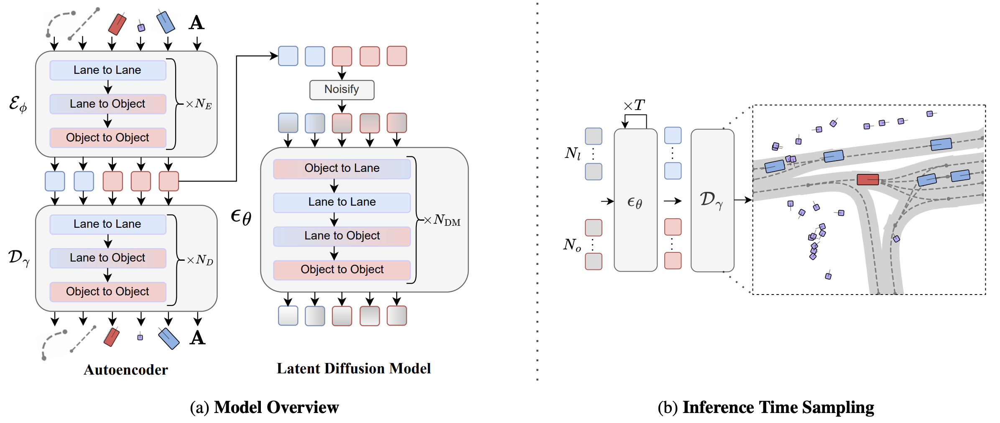

We embed each vectorized scene element into a latent representation with an autoencoder parameterized with factorized attention blocks, which additionally fuses the lane connectivity A. The latent Transformer diffusion model is trained to sample from the autoencoder's latent distribution. Scenario Dreamer samples novel driving scenes by initializing noise tokens which are iteratively denoised with the latent diffusion model over T steps and decoded into vectorized scene elements. The ego vehicle is denoted in red, with other agents colored in blue and pedestrians in purple.

## Fully Data-Driven Generative Simulation

We initialize simulation environments with Scenario Dreamer scenes and simulate surrounding agents with a CtRL-Sim behaviour model, yielding a fully data-driven generative simulator for autonomous vehicle planning. Below, we show videos of an IDM-based planner driving in Scenario Dreamer generated environments.

<div style="display: grid; grid-template-columns: repeat(3, 1fr); gap: 2px;">
  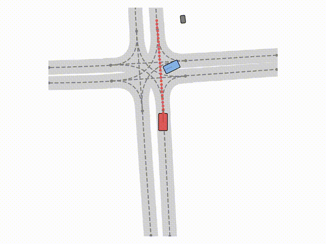
  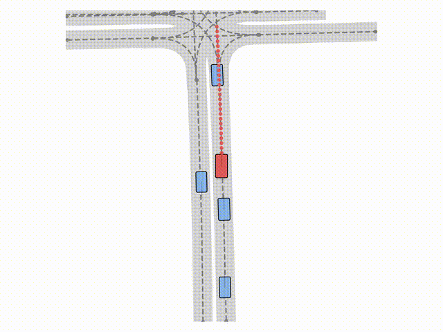
  
  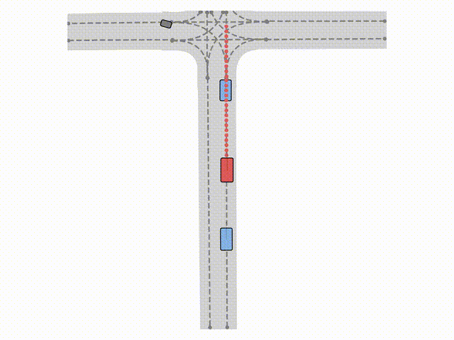
  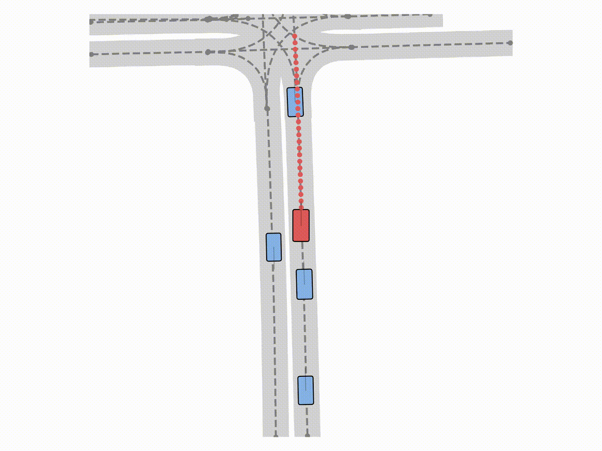
  
  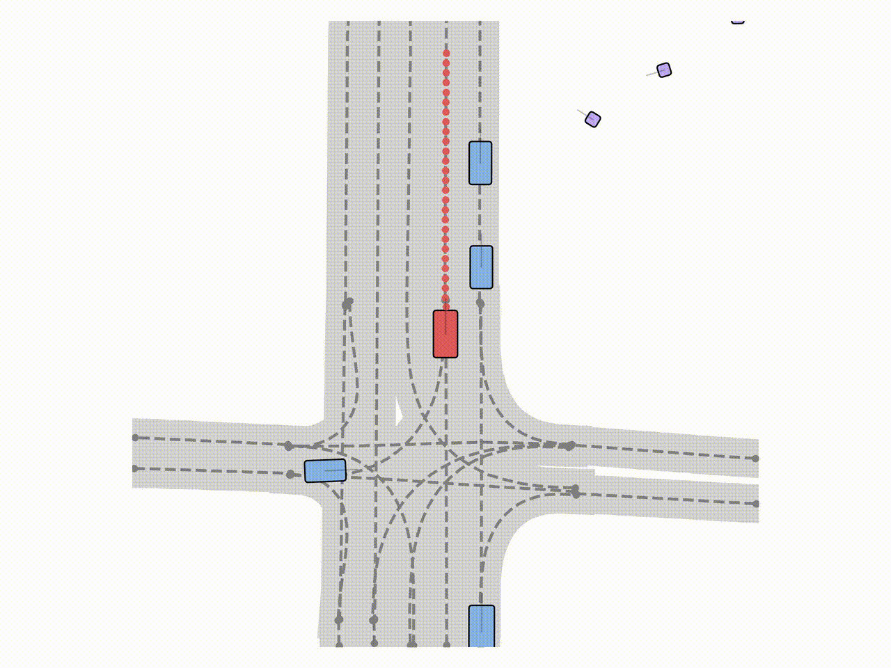
  
  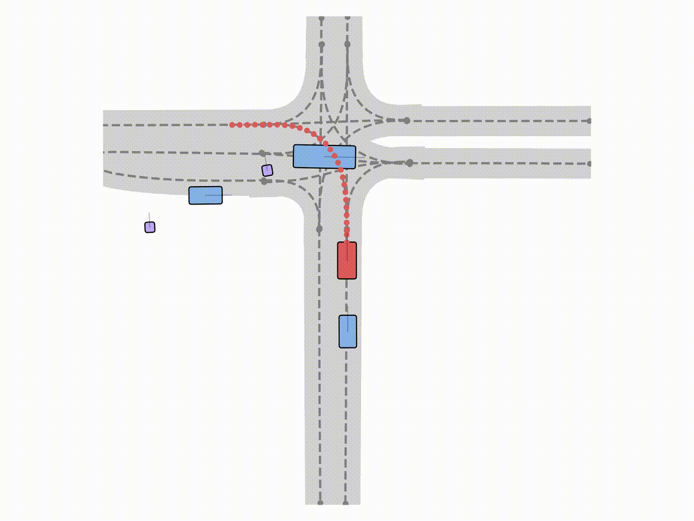
  
  
  
</div>

## Large Scene generation

A key feature of Scenario Dreamer is its ability to generate simulation environments of arbitrary size. Below, we visualize examples of 500m-route simulation environments generated by Scenario Dreamer via successive inpainting.


## Supported Generation Modes 

Below, we show examples of each of the supported generation modes with the Scenario Dreamer vectorized latent diffusion model: initial scene generation, lane-conditioned object generation, and scene inpainting. For initial scene generation and lane-conditioned object generation, we visualize the reverse diffusion chain that generated the corresponding samples.

**Initial Scene Generation**

<div style="display: grid; grid-template-columns: repeat(3, 1fr); gap: 2px;">
  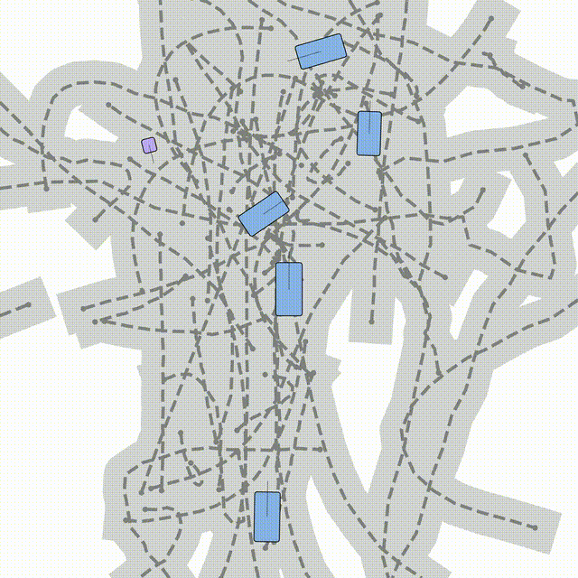
  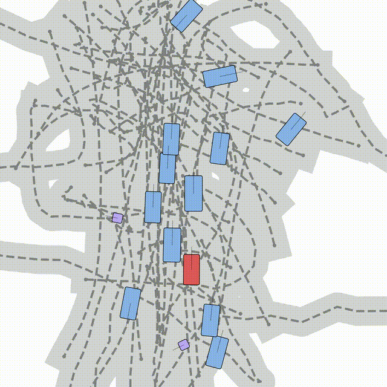
  
  
  
  
</div>

**Lane-conditioned Object Generation**

<div style="display: grid; grid-template-columns: repeat(3, 1fr); gap: 2px;">
  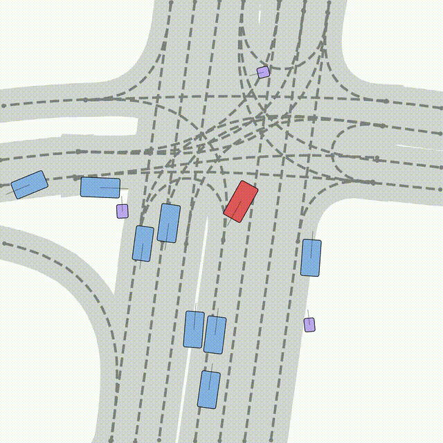
  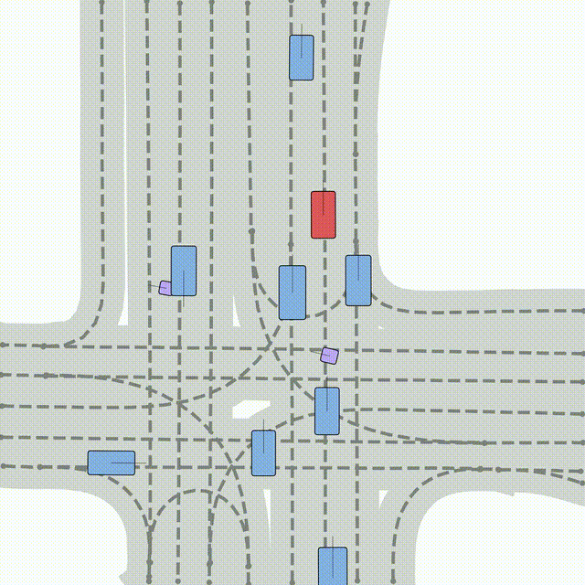
  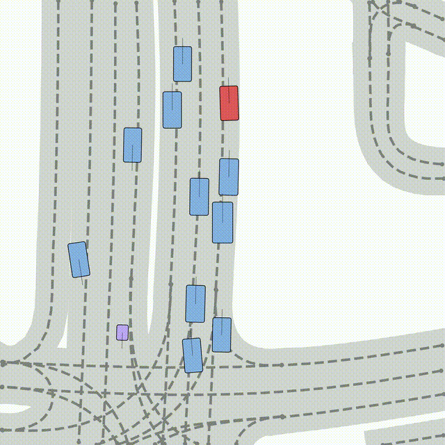
  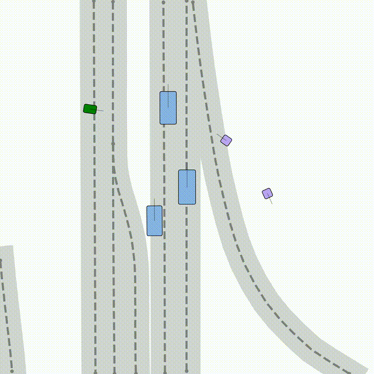
  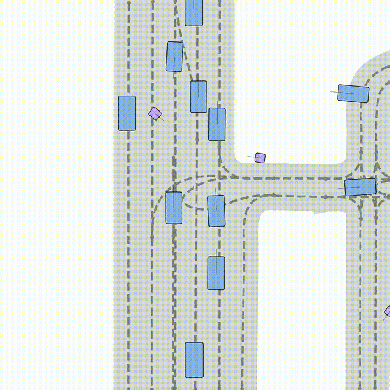
  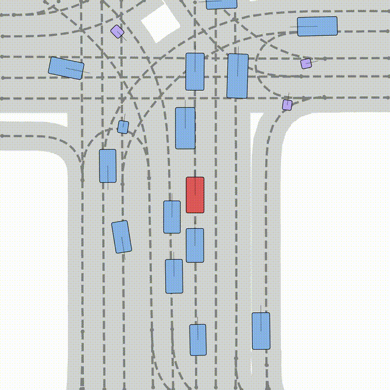
</div>

**Scene Inpainting**

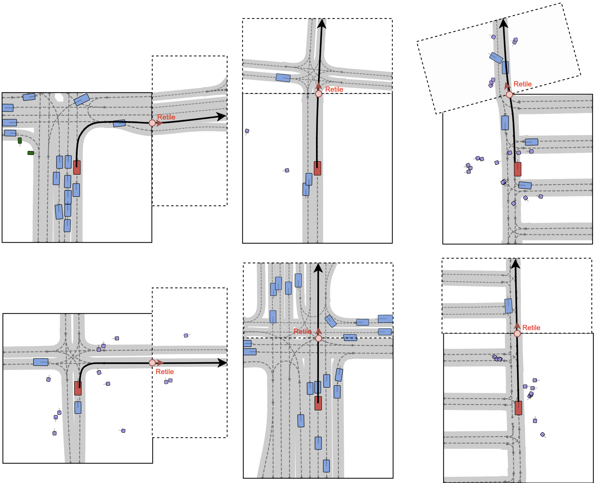

## Scene Diversity 

Scenario Dreamer generates diverse scenes. The first row shows five inpainting extraploations given the same left-half of the scene. The second row shows five scenes generated with 8 agents and 24 lanes. In both cases, Scenario Dreamer demonstrates plausible diversity in the generated scenes.

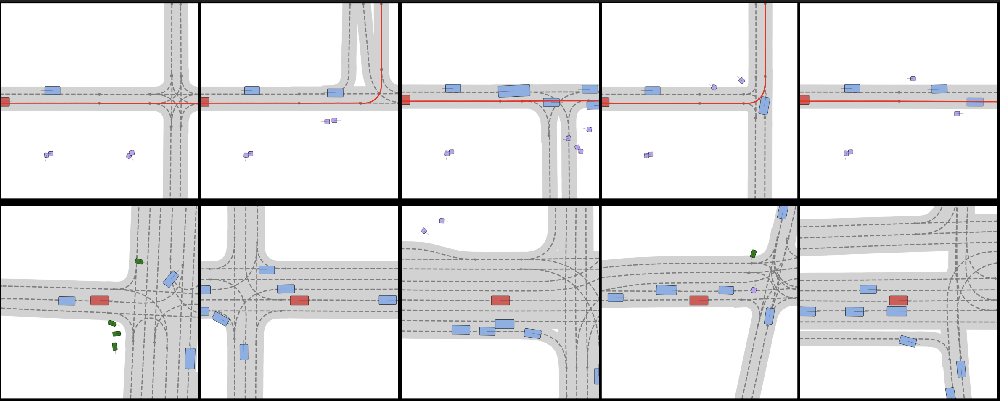

## Qualitative Comparison with Baselines

Scenario Dreamer agent and lane generations exhibit superior fidelity compared to previous works (SLEDGE on nuPlan and privileged DriveSceneGen on Waymo). We attribute these improvements to the fully vectorized processing of Scenario Dreamer.

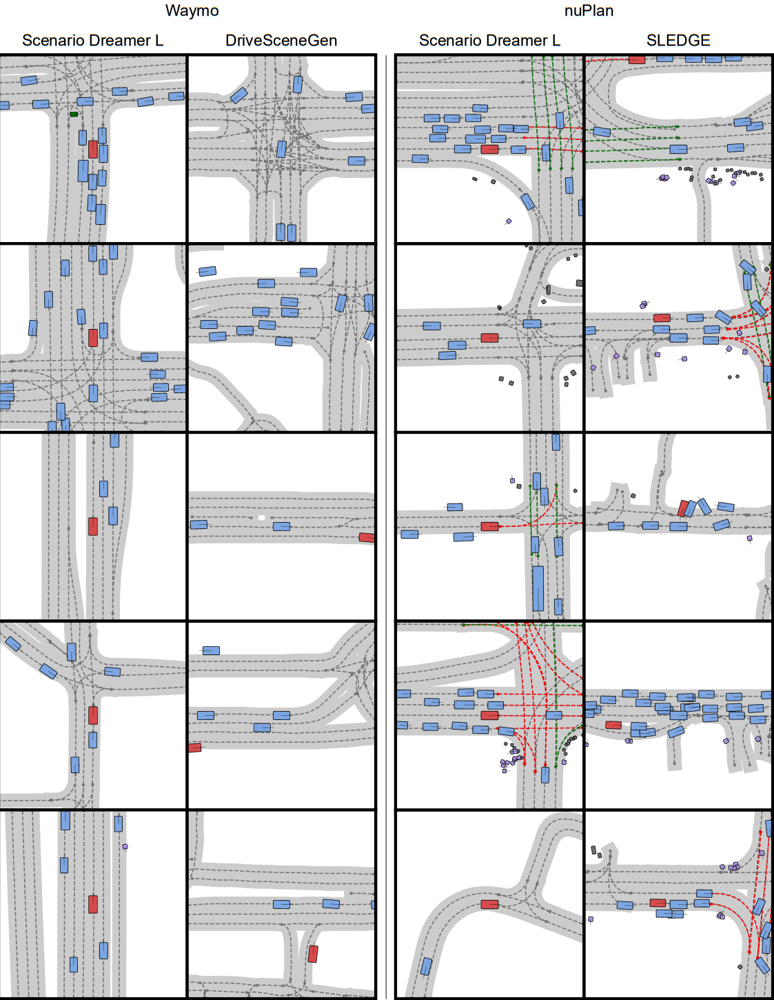

## Citation

```bibtex
@InProceedings{rowe2025scenariodreamer,
  title={Scenario Dreamer: Vectorized Latent Diffusion for Generating Driving Simulation Environments},
  author={Rowe, Luke and Girgis, Roger and Gosselin, Anthony and Paull, Liam and Pal, Christopher and Heide, Felix},
  booktitle = {Proceedings of the IEEE/CVF Conference on Computer Vision and Pattern Recognition (CVPR)},
  year={2025}
}
```
